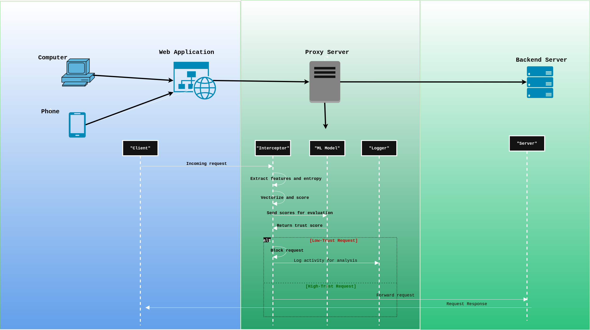

# ML-WAF: Machine Learning Web Application Firewall

## **Project Overview**

**ML-WAF** is a conceptual machine learning-based Web Application Firewall designed to detect and mitigate web attacks.
It combines automated request analysis, anomaly detection, and a feedback loop to improve security over time.

This project demonstrates an **end-to-end approach** to application-layer security using ML techniques, highlighting skills in cybersecurity, machine learning, and system design — without exposing sensitive source code.

---

## **Architecture**

Below is the high-level architecture of ML-WAF:

```
Incoming Requests
       ↓
  Feature Extraction
       ↓
      ML Model
       ↓
  Block / Allow Decision
       ↓
     Request Logs
       ↓
     Dashboard
       ↓
  Feedback Loop for False Positives
       ↓
    Model Retraining
```



**Components:**

* **WAF Layer:** Processes incoming requests and extracts features (payload size, special characters, headers, session info).
* **ML Layer:** Detects anomalies and attacks using Isolation Forest and supervised classifiers.
* **Dashboard:** Visualizes request logs, anomaly scores, and catch rates.
* **Feedback Loop:** Allows marking false positives, improving model accuracy over time.

---

## **Key Features (Conceptual)**

* **Automated Request Analysis:** Features extracted from headers, parameters, payloads, and sessions.
* **ML-Based Detection:** Isolation Forest for anomaly detection and supervised classifiers for known attacks.
* **Dashboard Visualization:** Anomaly graphs, request catch rates, and logs for monitoring.
* **Feedback Loop:** Human-in-the-loop learning to reduce false positives.
* **Attack Coverage (Currently) :**

  * ✅ DDoS
  * ✅ SQL Injection (SQLi)
  * ✅ Cross-Site Scripting (XSS)
  * ✅ HTML Injection (HTMLi)
  * ⚠ Local/Remote File Inclusion (LFI/RFI)
  * ⚠ Remote Code Execution (RCE)
  * ⚠ Server-Side Request Forgery (SSRF)

---

## **Future Work / Roadmap**

* Expand detection coverage for more advanced web attacks (SSRF, LFI, RCE).
* Integrate real human traffic to improve model performance.
* Enhance dashboard analytics with time-series trends and alerting.
* Optimize ML pipeline for low-latency and high-volume request handling.
* Consider deployment as a cloud-native service with horizontal scaling.

---

## **Why This Project Matters**

ML-WAF is a **demonstration of technical skill** in:

* Cybersecurity and web application protection
* Machine learning for anomaly detection
* System design and full-stack architecture
* Human-in-the-loop feedback and model retraining

---

## **License**

This project is **Proprietary / Closed Source**.
All content in this repository is © 2026 Your Name. Unauthorized copying, modification, or redistribution is prohibited.

> Note: This repository is **conceptual** — no live WAF source code is provided for security reasons.

---

## **Contact / Portfolio**

* **Email:** [MAIL](mailto:n3vrm1ndcode@gmail.com)
